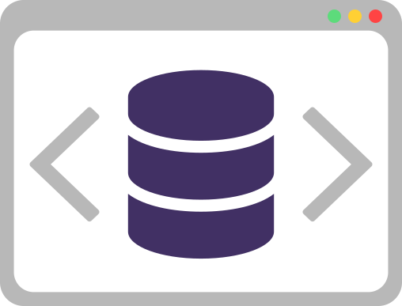

   

<h1 align="center">
   M151
</h1>

   Yannic Studer

# Introduction

This documentation will guide you through the process of setting up a database for a web development project using Laragon and PHP Storm (or Visual Studio Code). We will be using the Northwind database as an example.

## Setting up the Environment

1. Install [Laragon](https://laragon.org/) - a portable, isolated, fast & powerful universal development environment for PHP, Node.js, Python, Java, Go and also Ruby.
2. Install [PHP Storm](https://www.jetbrains.com/phpstorm/) from JetBrains, or [Visual Studio Code](https://code.visualstudio.com/), whichever you prefer.

## Setting up the Database

1. Start Laragon and navigate to the MySQL dashboard.
2. Click on the "New" button to create a new database.
3. Name the database "northwind" (without the quotes) and click "Create".
4. The Northwind database-scripts can be found in the `/assets` directory.
5. First copy and paste the `northwind.sql` into the MySQL command line, than also copy and paste the `northwind-data.sql` into the command line.
6. You should now have a fully functional Northwind database ready for use in your web development projects.
